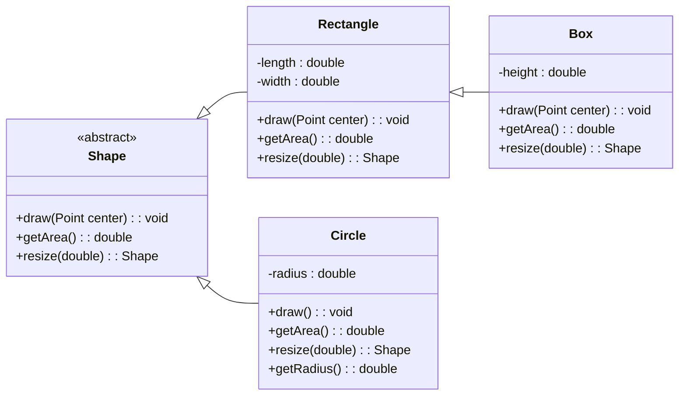

# Module 03 Team Activity - Object Oriented Programming (OOP)

Welcome to your first weekly team activity. Team Activities are guided (tutorial like) study sessions with your team. They are designed to help you learn the material in a more interactive way. 

## Grading
Grades for team activities will be based on attendance and notes. You must attend, and as a team you need to generate notes that we can confirm your work. Ideally, you upload the notes as a PDF to the team meeting after you build them out. 

> [!TIP] Good notes become a study guide for you and your team! Make sure they include everything you need to help better understand the weekly material. 

### ⭐ Working in Teams ⭐
When working in teams, remember do not let one person do all the work. Make sure to work together, and ask questions. It is also better if different people program, and you all take turns programming for various team assignments.

## Learning Objectives
This team activity is designed to help you understand the following concepts:
- Inheritance and Polymorphism
- When to use AbstractClasses vs Interfaces
- Composition (has-a) vs Inheritance (is-a)
- The four pillars of Object Oriented Programming
- Historical context of Object Oriented Programming


## Four Pillars of Object Oriented Programming

A common question in technical interviews are "describe the four pillars of Object Oriented Programming". These four pillars are the foundation of Object Oriented Programming, and help frame they "why" of some of the choices. 

They are:
- Encapsulation
- Inheritance
- Polymorphism
- Abstraction

### 👉🏽 Discussion
Take a moment to define each pilar as a team and discuss them. Define them in your notes. If the term is new to you, take time to look it up, and share what you find. We encourage you to put any resources you used in the notes.

### Biology?
Another way to look at OOP is via biology. In biology, we have the concept of a "class" (species), and an "object" (individual). However, in biology, we also have the concept of "inheritance" (genetics), "polymorphism" (different species), and "abstraction" (the idea of a species). These all sound nice in nature, but believe it or not, the concept of OOP came from a computer scientist who was also a microbiologist (much like the ALIGN students, he didn't start in computer science). [Alan Kay], the creator of OOP, was inspired by the biological world to create a new way of programming.

He emphasis that the main concept in OOP is not the objects, but the idea that messages are passed between the objects. This is a key concept in OOP, and one that is often overlooked. If you think from this biology perspective, cells are generalized objects that can be specialized into specific organs and tasks. However, what is more important is the messages passed between the cells, and the rest of the system assumes they do the job they are supposed to do. 

This makes objects "nouns" and methods "verbs" - with the emphasis on the verb. Sure you have an object that contains information, but the verbs tell it do something with that information. 

👉🏽 Take a moment to discuss this concept as a team. What does it mean to you? How does it change your perspective on OOP?

## Inheritance and Polymorphism - Is-A
Realistically, these two terms always go hand in hand. While inheritance is about reusing code and keeping your code DRY (Don't Repeat Yourself), good inheritance focuses on keeping the code polymorphic. 

### 👉🏽 Discussion

Why would this be the case? Can you think of any examples where inheritance is used but it would not be polymorphic?

### Example of (Good or Bad?) Inheritance

Let's take the following UML diagram. 


👉🏽 Discuss the UML diagram. Is it an example of good or bad inheritance, why or why not? 

Believe it or not, this is a common design, but in practice it actually breaks one of the "rules" (more like guidelines) that programmers should follow. It is known as the Liskov Substitution Principle. 

> The Liskov Substitution Principle (LSP) states that objects of a superclass shall be replaceable with objects of its subclasses without affecting the functionality of the program. While the 
> term was not coined by her, the concept was introduced by [Barbara Liskov] and later taught in courses across the world.

Or stated in code, anywhere Circle shows up in your code, you should be able to replace it with a Shape without affecting the functionality of the program. Excluding when the object is first created! 

Let's take a look at the following code:

```java
Shape shape = new Circle();
shape.draw();
```

In this case, circle is inherited from Shape, and it is polymorphic. You could also replace new Circle() with new Rectangle() and the rest of the code would still work! 

Even more to the point, if we had another method that takes in the Shape, we could pass in a Circle or a Rectangle and it would still work. 

```java
GameBoard board = new GameBoard();
board.addShape(new Circle());
board.addShape(new Rectangle());


// then inside game board

public void addShape(Shape shape) {
    // adds it to the game board
}

public void drawBoard() {
    for (Shape shape : shapes) { // go through all shapes
        shape.draw();
    }
}
```

### :computer: Practicing Inheritance


[Alan Kay]: https://en.wikipedia.org/wiki/Alan_Kay
[Barbara Liskov]: https://en.wikipedia.org/wiki/Barbara_Liskov