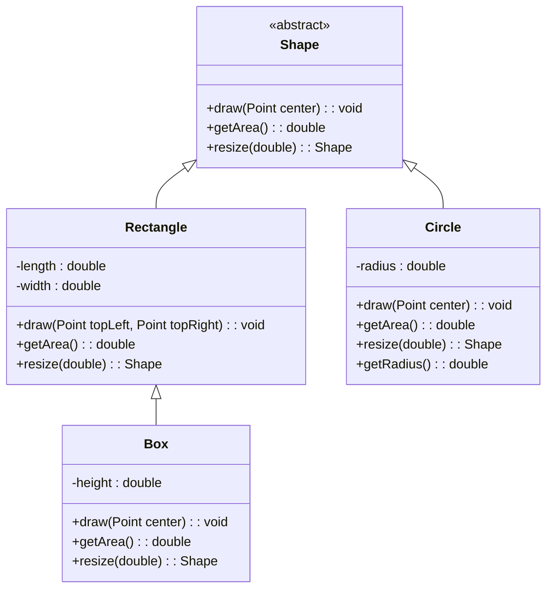
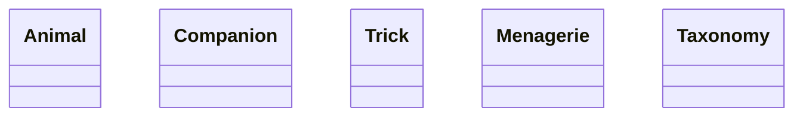

# Module 03 Team Activity - Object Oriented Programming (OOP)

Welcome to your first weekly team activity. Team Activities are guided (tutorial like) study sessions with your team. They are designed to help you learn the material in a more interactive way. 

## Grading
Grades for team activities will be based on attendance and notes. You must attend, and as a team you need to generate notes that we can confirm your work. Ideally, you upload the notes as a PDF to the team meeting after you build them out. 

> [!TIP] Good notes become a study guide for you and your team! Make sure they include everything you need to help better understand the weekly material. 

### ⭐ Working in Teams ⭐
When working in teams, remember do not let one person do all the work. Make sure to work together, and ask questions. It is also better if different people program, and you all take turns programming for various team assignments.

## Learning Objectives
This team activity is designed to help you understand the following concepts:
- Inheritance and Polymorphism
- When to use Interfaces
- Composition (has-a) vs Inheritance (is-a)
- The four pillars of Object Oriented Programming
- Historical context of Object Oriented Programming


## Four Pillars of Object Oriented Programming

A common question in technical interviews are "describe the four pillars of Object Oriented Programming". These four pillars are the foundation of Object Oriented Programming, and help frame they "why" of some of the choices. 

They are:
- Encapsulation
- Inheritance
- Polymorphism
- Abstraction

### 👉🏽 Discussion
Take a moment to define each pilar as a team and discuss them. Define them in your notes. If the term is new to you, take time to look it up, and share what you find. We encourage you to put any resources you used in the notes.

### Biology?
Another way to look at OOP is via biology. In biology, we have the concept of a "class" (species), and an "object" (individual). However, in biology, we also have the concept of "inheritance" (genetics), "polymorphism" (different species), and "abstraction" (the idea of a species). These all sound nice in nature, but believe it or not, the concept of OOP came from a computer scientist who was also a microbiologist (much like the ALIGN students, he didn't start in computer science). [Alan Kay], the creator of OOP, was inspired by the biological world to create a new way of programming.

He emphasis that the main concept in OOP is not the objects, but the idea that messages are passed between the objects. This is a key concept in OOP, and one that is often overlooked. If you think from this biology perspective, cells are generalized objects that can be specialized into specific organs and tasks. However, what is more important is the messages passed between the cells, and the rest of the system assumes they do the job they are supposed to do. 

This makes objects "nouns" and methods "verbs" - with the emphasis on the verb. Sure you have an object that contains information, but the verbs tell it do something with that information. 

👉🏽 Take a moment to discuss this concept as a team. What does it mean to you? How does it change your perspective on OOP?

## Inheritance and Polymorphism - Is-A
Realistically, these two terms always go hand in hand. While inheritance is about reusing code and keeping your code DRY (Don't Repeat Yourself), good inheritance focuses on keeping the code polymorphic. 

### 👉🏽 Discussion

Why would this be the case? Can you think of any examples where inheritance is used but it would not be polymorphic?

### Example of (Good or Bad?) Inheritance

Let's take the following UML diagram. 


👉🏽 Discuss the UML diagram. Is it an example of good or bad inheritance, why or why not? 

Believe it or not, this is a common design, but in practice it actually breaks one of the "rules" (more like guidelines) that programmers should follow. It is known as the Liskov Substitution Principle. 

> [!NOTE] The Liskov Substitution Principle (LSP) states that objects of a superclass shall be replaceable with objects of its subclasses without affecting the functionality of the program. 
> While the term was not coined by her, the concept was introduced by [Barbara Liskov] and later taught in courses across the world.

Let's take a look at the following code:

```java
Shape shape = new Circle();
shape.draw(centerPoint);
```

In this case, circle is inherited from Shape, and it is polymorphic. You could also replace new Circle() with new Rectangle() and the rest of the code would still work! 

Even more to the point, if we had another method that takes in the Shape, we could pass in a Circle or a Rectangle and it would still work. 

```java
GameBoard board = new GameBoard();
board.addShape(new Circle());
board.addShape(new Rectangle());


// then inside game board

public void addShape(Shape shape) {
    // adds it to the game board
}

public void drawBoard() {
    for (Shape shape : shapes) { // go through all shapes
        shape.draw(nextPoint); // draw the shape - what about Rectangles!? 
    }
}
```

### But is it really bad?
Yes and no - Yes if you don't properly override draw(point) with only one point. It is a fine design if you make sure both versions of draw are implemented.  However, a single center doesn't make sense if we are talking about an some shapes like an oval, so what happens there?

Needless to say, as we start talking about design there are multiple choices that come into play, often more dependant on our **data and domain**, than just how we code the application. 


In the above case, it may make sense for draw() to actually exist in the GameBoard, and the shape to be passed in as the parameter. This way, the GameBoard can decide how to draw the shape, and the shape can focus on what it is and providing the information it needs

### Common Confusion
Why doesn't Circle violate the principle? It has a getRadius() method, and the Shape class doesn't have a getRadius() method. It is easy to get it "backwards". Every Circle can be a shape, but not every Shape can be a Circle. If we have a method that specifically needs a radius, then we should be using a Circle, not Shape as the parameter. For example:

```java
public void circleOnly(Circle circle) {
    double radius = circle.getRadius();
}
```

### 👉🏽 Discussion
That is a lot! Go ahead and discuss. How does this change your perspective on inheritance?

> [!TIP] 
> A major take away, when designing code your parameter should be the 
> the most "generic" (highest parent in the tree) type that you can use. 
> This allows you to pass in anything that inherits the object, and
> allows the object to provide specific information related to it.


## What about Interfaces?

Interfaces are a way to define a contract that a class must follow, but it is also polymorphic in that we can use it in place of the class for things like method parameters.

Using the circle example, we may point out there are multiple shapes that have a radius (Cylinder, Cone, Oval, Sphere), and not all of them are circles nor does it make sense to make them sub-classes (or super) of Circle. 

As such, by defining an interface, we can make sure that all shapes that have a radius implement the interface, and we can use the interface in place of the class. 

```java
public interface HasRadius {
    double nextRadius(); // has the ability to return one radius, or more if needed
    int getNumberOfRadii();
}

public class Circle extends Shape implements HasRadius {
    private double radius;
    /// other code

    @Override
    public double nextRadius() {
        return radius;  // always just return the one radius
    }

    @Override
    public int getNumberOfRadii() {
        return 1;
    }
}


```

Then some other code in the program do something like this:

```java
public void doSomethingWithRadius(HasRadius shape) { // NOTICE parameter type!
    double radius = shape.nextRadius();
    int numRadii = shape.getNumberOfRadii();
    // do something with this info
}
```

This "magic" of polymorphism is what makes OOP so powerful, as long we stick to the guidelines thinking about how it can be used via substitution, and how verbs are **actions** that may vary from item to item, even if they are the same type. 

> Example: *how* a shape calculates area is different for every shape, but the "verb" getArea() is the same for all shapes. 


> [!IMPORTANT]
> How do I learn all this? Practice! Practice! Practice!
> Really, it takes time to start seeing this. 
> The more you code, the more you will start to see these patterns. 

### 👉🏽 Discussion
Take time to explain the concepts to each other. What other questions come up as you discuss this? 

## :computer: Refactoring 

Let's practice! One of the more difficult but often best ways to learn design is by refracting (rewriting) code. This is often best if you practice with your own code, as you seek to improve it in the future. However, it is good (and sadly common in industry) for someone to have to refractor someone else's code. 

With this team activity, there is a series of classes trying to represent a Menagerie of Animal Companions. The code is a bit of a mess, and it is up to you to refactor it.

For the next part of the team activity, we will step through some key points, but how you refractor it may depend a bit on the group discussion! Don't worry, there isn't a single answer, so while we present a possible solution at the end - your solution may be different. That is fine.  

### 👉🏽 Discussion 
Go through the design, and highlight at least three things you can see to change just based on the code.

Now with this in mind, it is good to think about the domain of the problem. The client wants to represent a Menagerie of Animal Companions. They need to get various information about an animal including the common name, scientific taxonomy, and the sound it makes. They also want to assign tricks to each companion. Furthermore, the Menagerie should also be able to keep animals that are not companions. They are just living there to live there, but aren't associated as a named companion. 

With that in mind, does the current inheritance structure make sense? Why or why not?

### :question: Question 1: Ask - What are needed Nouns (objects)

Take a moment based on the short client description to identify the nouns (objects) that are needed. While the programmer / examples focuses heavily on the taxonomy of animals, and each object being a subclass of another, it may not be the best way to represent the data.

As a group, try to define the objects that are needed.

Now, have a designated person start a UML diagram with the objects you have identified. Right now, there won't be any relationships or insides to each object, just the names.

For example, it could look like



> [!TIP] Bonus - 
> If the designated person is using `mermaid` markdown in a markdown file, others can see the code they use. For example, using the code above, it would look like this:

> ````
> ```mermaid
> classDiagram
>    class Animal
>    class Companion
>    class Trick
>    class Menagerie
>    class Taxonomy
> ```
>````

### :question: Question 2: Define - What are the "is-a" and "has-a" relationships?

Now that you have the objects, start to define the relationships between the objects.
Which objects have a "is-a" relationship, and which objects have a "has-a" relationship?

It is also alright to ask are there any objects that should be interfaces or abstract classes? While it is good to ask at this stage, it is often found that as you program, you may need to refactor to add interfaces or abstract classes.

Discuss and add the changes to the UML. 

> [!TIP] Mermaid
> If you are using mermaid, you can use the following code to show the relationships.
> ````
> ```mermaid
> classDiagram
>     Animal <|-- Companion
>     Animal  -->  "1" Taxonomy 
>     Companion --> "*" Trick
> ```
> ````
> This would show that Animal is a parent of Companion, and that Animal has a Taxonomy. 
> A Companion has many Tricks.
>
> The above would look like the following
> ```mermaid
>     classDiagram
>     Animal <|-- Companion
>     Animal  -->  "1" Taxonomy 
>     Companion --> "*" Trick
> ```

> [!NOTE] Cardinality
> While not required, the above mermaid example introduces "Cardinality" another 
> aspect of UML especially for has-a relationships. The "\*" means "many" and 
> the "1" means "one". Common symbols are "0..1" for zero or one, and "0..*" 
> for zero or many. It is also common to put "n" instead of "\*". The 
> difference is more organization dependant, and best to follow company guidelines.


### :question: Question 3: Attributes of Nouns
Now that you have the relationships, what are some of the "attributes" or "properties" of each object? These are items that *belong* to the object (parameters). Often these should 
be private, and accessed via getters and setters. (Make sure to discuss why, if you are unsure about this!)

Discuss and add the attributes to the UML. For the many relationships you can just say List
or make it a List of the type, which is List<Animal> for example. 

> [!WARNING]
> What is a List?!?  It is very similar to the List you covered in python, and in the
> next module we will cover it in detail. For now, it is a container that can hold
> multiple objects of the same type in order. You can see the example both in the
> provided (poorly written) Menagerie.java and Animal.java. Two major differences
> than how you use one in python is that you have to specify the types that are
> to be stored in the list, and that you *have* to use methods to access (no split [] or [:] in Java for Lists).

> [!TIP]Mermaid
> If you are using mermaid, you can use the following code to show the attributes.
> ````
> ```mermaid
> classDiagram
>     Animal <|-- Companion
>     Animal  -->  "1" Taxonomy
>     Companion --> "*" Trick
>     class Animal {
>       - taxonomy: Taxonomy
>     }
>     class Companion {
>       - tricks: List~Trick~ 
>     } 
> ```
> ````
> This would look like the following:
> ```mermaid
> classDiagram
>     Animal <|-- Companion
>     Animal  -->  "1" Taxonomy
>     Companion --> "*" Trick
>     class Animal {
>       - taxonomy: Taxonomy
>     }
>     class Companion {
>       - tricks : List~Trick~
>     }
> ```

### :question: Question 4: Actions/Verbs of Objects (Methods)

Now think of the various actions you would want each object to take. These are the methods that are associated with the object, and another way to look at them is the "verbs" in the system. They are active and do something. 

After discussing, add them to the UML diagram. 

> [!TIP] Mermaid
> Mermaid figures out which items are attributes, and which are
> methods based on the use of the parentheses. All 
> methods should have parentheses after them, whether they take 
> in a parameter or not. Continuing with the above example,
> the code in the markdown could look like the following:
> ````
> ```mermaid
>  classDiagram
>     Animal <|-- Companion
>     Animal  -->  "1" Taxonomy
>     Companion --> "*" Trick
>     class Animal {
>       - taxonomy: Taxonomy
>       + toString()  String
>     }
>     class Companion {
>       - tricks: List~Trick~
>       + addTrick(Trick)  void
>       + getName()  String 
>       + toString()  String
>     } 
> ```
> ````
> This would look like the following:
> ```mermaid
>  classDiagram
>     Animal <|-- Companion
>     Animal  -->  "1" Taxonomy
>     Companion --> "*" Trick
>     class Animal {
>       - taxonomy: Taxonomy
>       + toString()  String
>     }
>     class Companion {
>       - tricks: List~Trick~
>       + addTrick(Trick)  void
>       + getName()  String
>       + toString()  String
>     }
> ```

> [!CAUTION] toString()
> Did you remember to include toString() for most your objects? While
> toString() is inherited from the Object class, it is often best to
> override it in your classes to provide a more meaningful output.
> The default output is the class name and the memory address of the object,
> which can be useful, not not as much as your custom output.


<!-- Link references -->

[Alan Kay]: https://en.wikipedia.org/wiki/Alan_Kay
[Barbara Liskov]: https://en.wikipedia.org/wiki/Barbara_Liskov