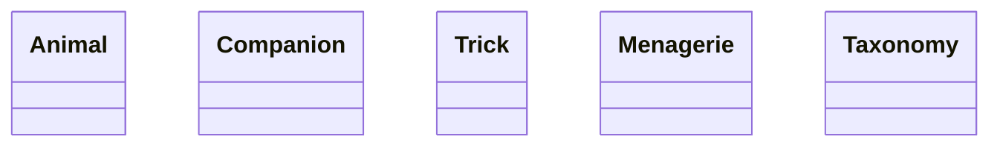
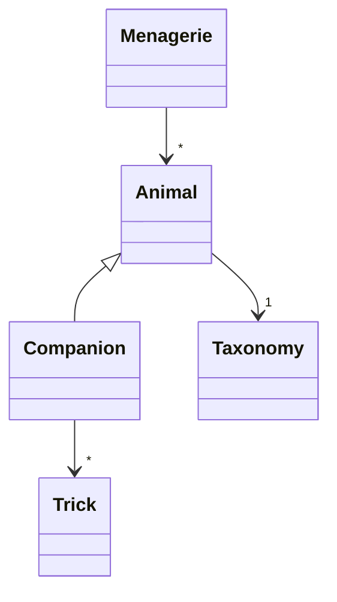
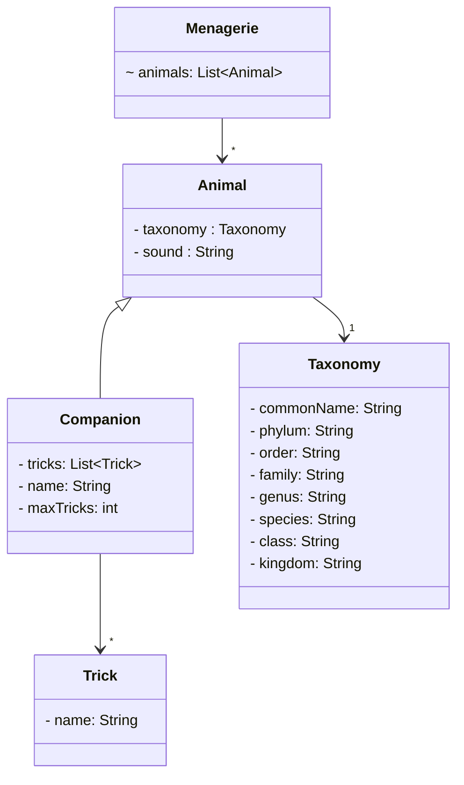
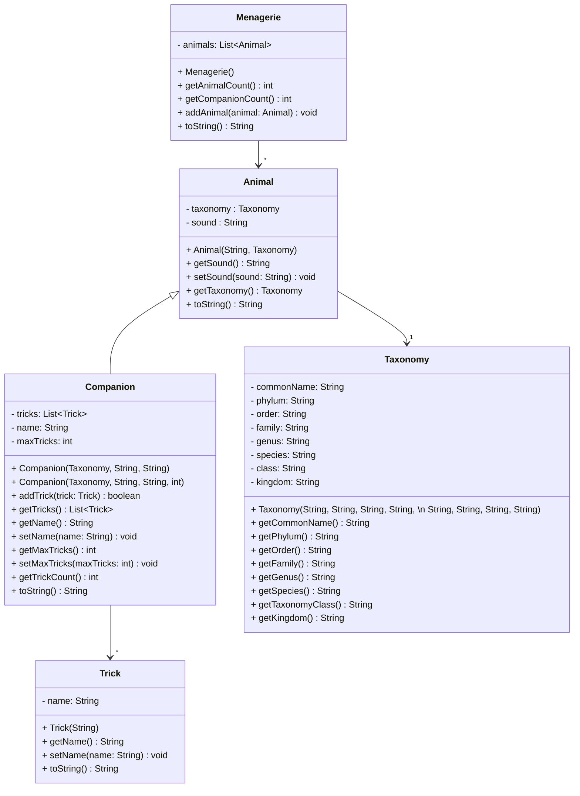
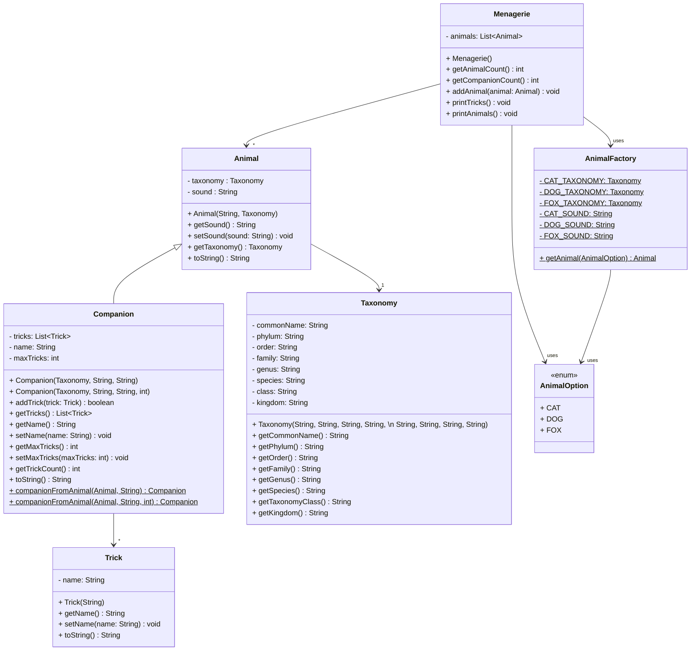

# Solution

:warning: **Note**: This is a solution to the team activity. This is **A** solution. There are other ways your team could have implemented the code.


Each section in the readme corresponds to a section in the team activity. The code itself exists in this directory. Remember, you do NOT have to stick with this solution. This is just one to help guide you. 

- [Solution](#solution)
  - [Question 1: Ask - What are needed Nouns (objects)](#question-1-ask---what-are-needed-nouns-objects)
  - [Question 2: Define - What are the "is-a" and "has-a" relationships?](#question-2-define---what-are-the-is-a-and-has-a-relationships)
  - [Question 3: Attributes of Nouns](#question-3-attributes-of-nouns)
  - [Question 4: Actions/Verbs of Objects (Methods)](#question-4-actionsverbs-of-objects-methods)
  - [Final Solution](#final-solution)


## Question 1: Ask - What are needed Nouns (objects)

- Animal 
- Companion 
- Trick
- Menagerie
- Taxonomy




Note, there is a logical argument for Companion to be specific animals, but the problem with that argument as every time a new animal companion type is added a new class needs to be added. It is not a scalable solution, but it can fit depending on the scope of the project.

There is also an argument for Animal to be something more like "Resident" or "Creature". This really is more of an issue with language and how we interpret the problem. Someone could be looking as Menagerie to be a magical menagerie for a story or game - and question where would you put a Trent, as it is plant based and not an animal. However, based on the problem statement, it made more sense to use animal in this case and not obfuscate the problem with a more general term.


## Question 2: Define - What are the "is-a" and "has-a" relationships?

- Animal
  - has-a: Trick
  - has-a: Taxonomy
- Companion
  - is-a: Animal
  - has-a: Trick
- Menagerie
  - Has many: Animal / Companion 
  - Can create Trick's to add to animals. 



The above diagram uses symbols you may not have seen before, known as "cardinality" symbols. The "*" means "many" and the "1" means "one". So, for example, an Animal has one Taxonomy, but a Menagerie has many Animals.

The way to "read" the above diagram is A Menagerie has many Animals. An Animal has one Taxonomy. An Companion is an Animal. A Companion has many Tricks.


## Question 3: Attributes of Nouns

- Menagerie
  - animals : List of Animal
- Animal
  - taxonomy : Taxonomy
  - sound : String 
- Companion
  - tricks : List of Trick
  - name: String
  - maxTricks: int 
- Trick
  - name: String 
- Taxonomy
  - commonName: String
  - phylum: String
  - order: String
  - family: String
  - genus: String
  - species: String
  - class: String
  - kingdom: String


It may be arguable if maxTricks is needed, though we included it as it was in the original design. That would be a question to take back to the client and other shareholders. It could be their shouldn't be a max. Or maybe there is a cost associated with each trick and the max is a budget. 



## Question 4: Actions/Verbs of Objects (Methods)

At this point, we will just use the UML diagram. The Menagerie methods were
just added to help figure out the rest of the design, and are optional given
the specific requirements of the problem.



## Final Solution

The final solution code is in the directory. A sample output from the solution is as follows:

```plaintext
Animal{Cat says Meow}
Animal{Cat says Meow}
Animal{Dog says Woof}
Animal{Fox says No one knows what the fox says.}
Companion{Whiskers says Meow, and knows 1 tricks.}
Companion{Fido says Woof, and knows 2 tricks.}
Companion{Foxy says No one knows what the fox says., and knows 1 tricks.}
Companion{Rover says Woof, and knows 2 tricks.}
Companion{Fluffy says Meow, and knows 2 tricks.}
Whiskers knows the following tricks: Jump
Fido knows the following tricks: Roll over, Play dead
Foxy knows the following tricks: Steal food
Rover knows the following tricks: Fetch, Shake
Fluffy knows the following tricks: Climb, Hide
```

The UML diagram is as follows:



In UML, the underlined variables and methods are static. The <<enum>> is a stereotype that denotes an enumeration which is a specialized class
that helps determine options (often in switch statements).

The main changes from this diagram from the original are the addition of the AnimalFactory and AnimalOption classes. The AnimalFactory class is a factory class that creates Animal objects based on the AnimalOption enumeration. The AnimalOption enumeration is a list of options for the AnimalFactory to create. This is a common pattern in software development to separate the creation of objects from the objects themselves. 