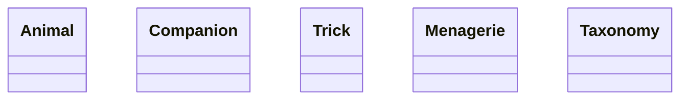
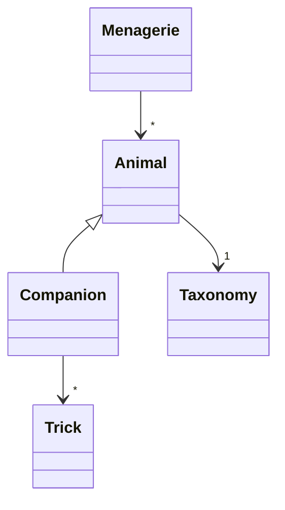
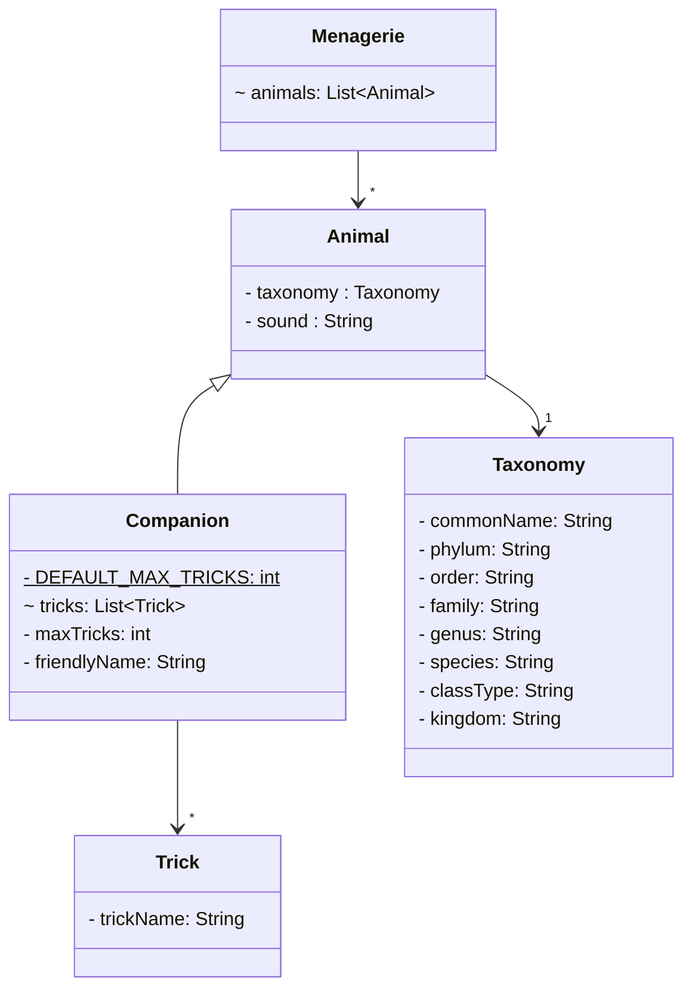
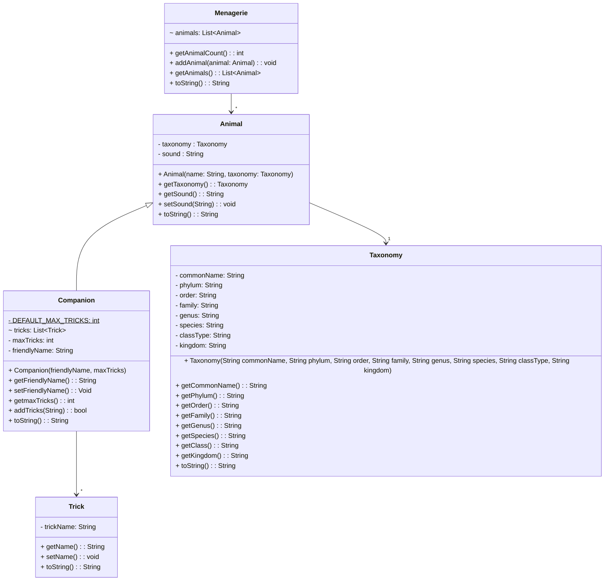

### 1. Ask - What are the needed Nouns?

```mermaid
classDiagram
    class Animal
    class Companion
    class Trick
    class Menagerie
    class Taxonomy
```

### 2. What are the is - a / has - a relationships?

```mermaid
classDiagram
    class Animal
    class Companion
    class Trick
    class Menagerie
    class Taxonomy

    Menagerie --> "*" Animal
    Animal <|-- Companion
    Animal  -->  "1" Taxonomy
    Companion --> "*" Trick


```

### 3. Question 3: Attributes and Fields of Nouns

```mermaid
classDiagram
    class Animal
    class Companion
    class Trick
    class Menagerie
    class Taxonomy

    Menagerie --> "*" Animal
    Animal <|-- Companion
    Animal  -->  "1" Taxonomy
    Companion --> "*" Trick

    class Menagerie {
        ~ animals: List~Animal~
    }

    class Animal {
        - taxonomy : Taxonomy
        - sound : String

    }

    class Taxonomy {
        - commonName: String
        - phylum: String
        - order: String
        - family: String
        - genus: String
        - species: String
        - classType: String
        - kingdom: String
    }

    class Companion {
        - DEFAULT_MAX_TRICKS: int $
        ~ tricks: List~Trick~
        - maxTricks: int
        - friendlyName: String

    }
    class Trick {
        - trickName: String
    }

```

### 4. Question 4: Actions and Methods

```mermaid
classDiagram
    class Animal
    class Companion
    class Trick
    class Menagerie
    class Taxonomy

    Menagerie --> "*" Animal
    Animal <|-- Companion
    Animal  -->  "1" Taxonomy
    Companion --> "*" Trick

    class Menagerie {
        ~ animals: List~Animal~
        + getAnimalCount(): int
        + addAnimal(animal: Animal): void
        + getAnimals(): List~Animal~
        + toString(): String 
    }

    class Animal {
        - taxonomy : Taxonomy
        - sound : String
        + Animal(name: String, taxonomy: Taxonomy)
        + getTaxonomy(): Taxonomy
        + getSound(): String
        + setSound(String): void
        + toString(): String

    }

    class Taxonomy {
        - commonName: String
        - phylum: String
        - order: String
        - family: String
        - genus: String
        - species: String
        - classType: String
        - kingdom: String
        + Taxonomy(String commonName, String phylum, String order, String family, String genus, String species, String classType, String kingdom)
        + getCommonName(): String
        + getPhylum(): String
        + getOrder(): String
        + getFamily(): String
        + getGenus(): String
        + getSpecies(): String
        + getClass(): String
        + getKingdom(): String
        + toString(): String
    }

    class Companion {
        - DEFAULT_MAX_TRICKS: int $
        ~ tricks: List~Trick~
        - maxTricks: int
        - friendlyName: String
        + Companion(friendlyName, maxTricks)
        + getFriendlyName(): String
        + setFriendlyName(): Void
        + getmaxTricks(): int
        + addTricks(String): bool
        + toString(): String
    }

    class Trick {
        - trickName: String
        + getName(): String
        + setName(): void
        + toString(): String
    }
```