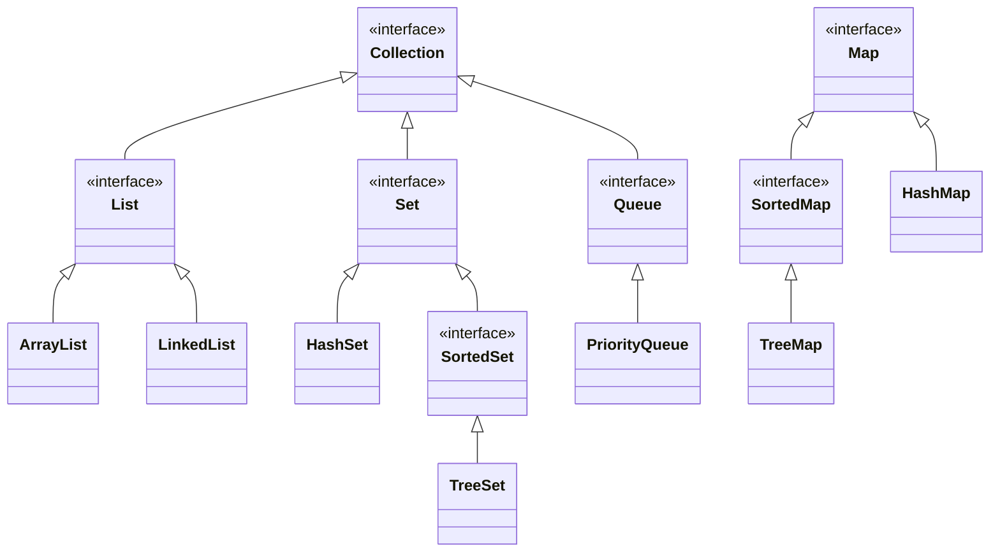

# Module 04 Team Activity - Java Collections Framework

For this activity, we are going to explore the collections framework, and
how to manipulate data structures with the Stream object. 

## Grading
Grades for team activities will be based on attendance and notes. You must attend, and as a team you need to generate notes that we can confirm your work. Ideally, you upload the notes as a PDF to the team meeting after you build them out. 

> [!TIP] 
> Good notes become a study guide for you and your team! Make sure they include everything you need to help better understand the weekly material. 

### ⭐ Working in Teams ⭐
When working in teams, remember do not let one person do all the work. Make sure to work together, and ask questions. It is also better if different people program, and you all take turns programming for various team assignments.

## Learning Objectives
This team activity is designed to help you understand the following concepts:
- How to use the Collections Framework
- Key Data Structures in Java
- Understanding Polymorphism to simplify your code
- How to use the Stream object to manipulate data structures
- How to use the Stream object to filter data
- How to use the Stream object to sort data
- How to use the Stream object to map data
- How to use the Stream object to reduce data

## Collections Framework

Java quickly gained in popularity since it came out in 1996 due to three major features. The first was built in garbage collection. You had a 'c' like language that managed memory for you. The second was that it was advertised to write once, and run on every machine. The third was an extensive API of classes that "shipped" with the Java Development Kit (JDK). These are now called the [Java Core Libraries].

Of the core libraries, the Collections Framework is one of the most used. It is a set of classes and interfaces that implement commonly reusable data structures.  In python, you know of List and Dictionary, those are both data structures. In Java, you have a similar set of data structures, though types are more strictly enforced.

The Collection Framework has the following interfaces and associated classes:

In the above diagram, the interfaces much of the framework, with the sample classes being listed for each item. Technically, classes like LinkedList implement both List and Queue, so isn't as simple as the diagram above.  Java has extensive documentation on [Collections].

For a comparison between Python and Java, dictionaries are like maps, lists are like lists, and sets are like sets.  

> [!NOTE]
> For more details beyond this course a good tutorial can be found at https://stackabuse.com/java-collections-the-list-interface/, and the java framework can be found at https://docs.oracle.com/en/java/javase/21/core/java-core-libraries1.html.  Along with the tutorial at https://docs.oracle.com/javase/tutorial/collections/interfaces/index.html. 

<!-- Links -->
[Java Core Libraries]: https://docs.oracle.com/en/java/javase/21/core/java-core-libraries1.html
[Collections]: https://docs.oracle.com/en/java/javase/21/docs/api/java.base/java/util/package-summary.html#JavaCollectionsFramework